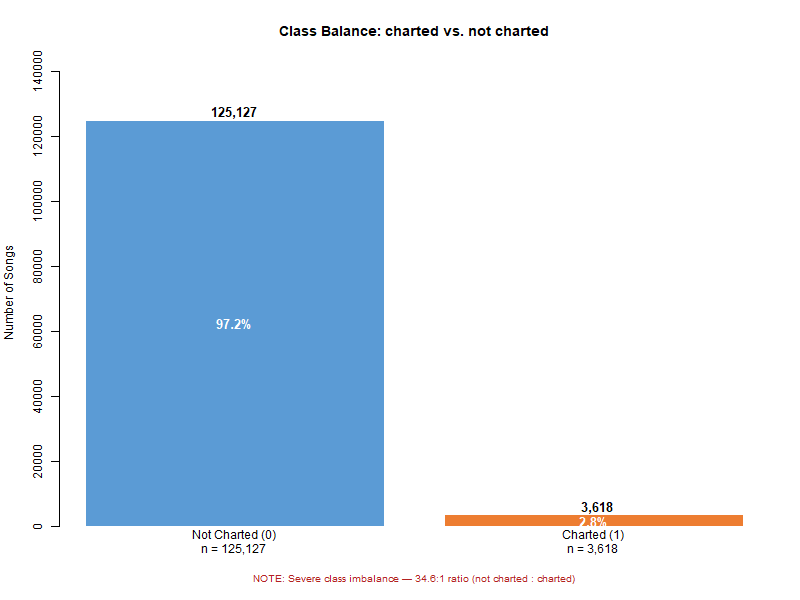
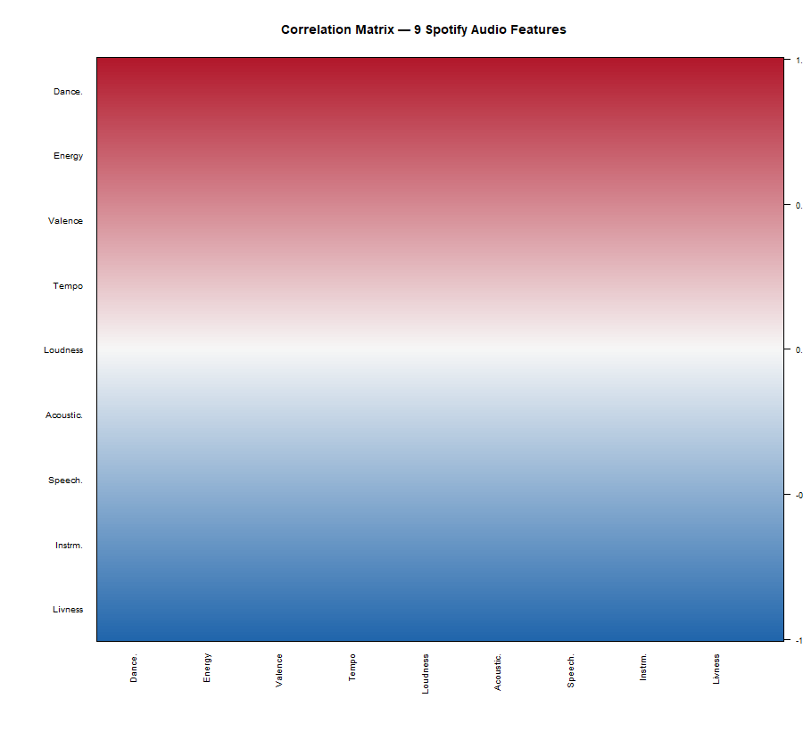
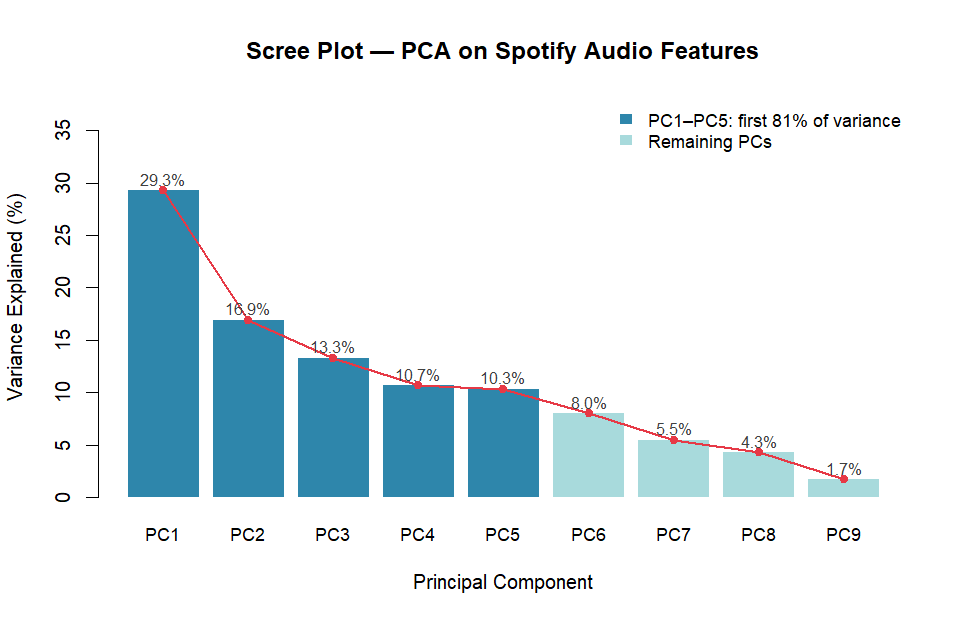
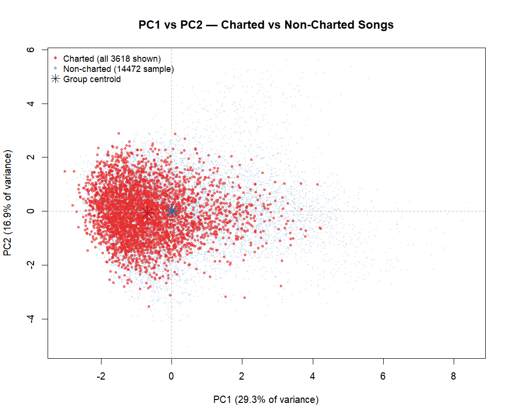
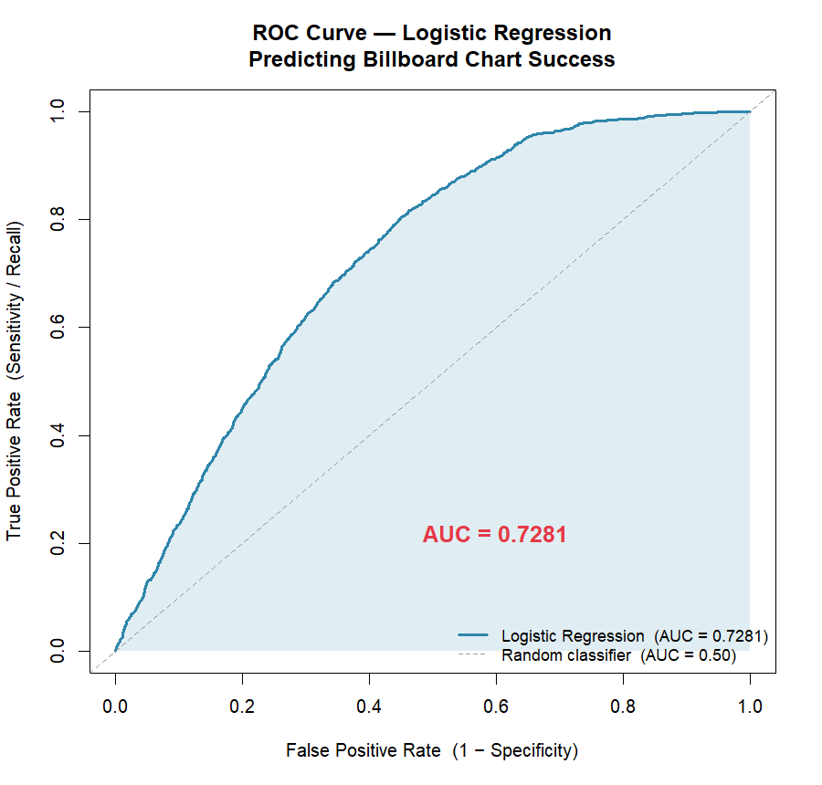

# Predicting Billboard Hot 100 Chart Success from Spotify Audio Features
## Final Project Report

**Course:** BUAN 6312 / STAT 6312 (Applied Statistics)  
**Student:** Gurpreet Kaur  
**Date:** April 18, 2026  
**Working Directory:** `D:/SpotifyBillboardProject`

---

## Abstract

This project investigates whether the audio features that Spotify computes for every song — such as loudness, danceability, energy, and acousticness — are statistically associated with whether a song appeared on the Billboard Hot 100 chart between 1999 and 2019. Using a merged dataset of 128,745 songs built from two Kaggle source tables, four analytical methods were applied in sequence: Exploratory Data Analysis (EDA), hypothesis testing, Principal Component Analysis (PCA), and logistic regression. All nine audio features showed statistically significant differences between charted and non-charted songs. Loudness emerged as the feature with the largest practical effect size. A logistic regression model trained on a class-balanced subset and evaluated on a held-out test set achieved an AUC of **0.7281**, which falls within the project proposal's expected range of 0.70–0.80. Results are interpreted as associations, not causal claims.

---

## 1. Introduction

The music industry has long sought objective, quantifiable signals of chart success. Streaming platforms such as Spotify now compute a rich set of audio features for every track in their catalog — features that measure the acoustic, rhythmic, and structural properties of music algorithmically, at scale.

This project asks a simple question: **Can we predict whether a song will appear on the Billboard Hot 100 chart using only its Spotify audio features?**

The answer has practical implications for artists, producers, and labels who want data-driven feedback on recordings before release. It also has academic interest as a case study in applying statistical learning to a real-world classification problem with severe class imbalance.

The project follows a structured four-step statistical workflow:

1. Exploratory Data Analysis — visual and summary exploration  
2. Hypothesis Testing — formal comparison of charted vs. non-charted songs  
3. Principal Component Analysis — dimensionality reduction and structure discovery  
4. Logistic Regression — binary classification and model evaluation  

---

## 2. Research Questions

**Primary question:**  
Do charted songs (Billboard Hot 100 appearances, 1999–2019) differ from non-charted songs in their Spotify audio feature values, and can those differences be used to build a predictive model?

**Secondary questions:**  
- Which specific audio features most strongly separate charted from non-charted songs?  
- How much of the variation in audio feature space can be captured by a small number of principal components?  
- Does a logistic regression model using audio features alone achieve meaningful predictive discrimination (AUC ≥ 0.70)?  

---

## 3. Data Description

### 3.1 Source

The data were obtained from a Kaggle dataset covering songs from 1999–2019. The download contained two separate source tables:

| Table | Rows | Description |
|-------|------|-------------|
| `songAttributes_1999-2019.csv` | 154,931 | Spotify audio features for songs |
| `billboardHot100_1999-2019.csv` | 97,225 | Billboard Hot 100 chart entries |

These were merged by matching on cleaned song name and primary artist name using script `01b_build_merged_dataset.R`. The resulting analysis file was:

**`data/processed/spotify_billboard_merged_full.csv`** — 128,745 rows, 18 columns.

### 3.2 Outcome Variable

| Column | Type | Meaning |
|--------|------|---------|
| `charted` | Binary integer (0/1) | 1 = appeared on Billboard Hot 100; 0 = did not chart |

### 3.3 Predictor Variables

Nine Spotify audio features were used as predictors:

| Feature | Scale | Description |
|---------|-------|-------------|
| `danceability` | 0–1 | How suitable a track is for dancing |
| `energy` | 0–1 | Perceptual intensity and activity |
| `valence` | 0–1 | Musical positiveness / mood |
| `tempo` | BPM | Estimated beats per minute |
| `loudness` | dB | Overall loudness (typically negative) |
| `acousticness` | 0–1 | Confidence that track is acoustic |
| `speechiness` | 0–1 | Presence of spoken words |
| `instrumentalness` | 0–1 | Likelihood of no vocal content |
| `liveness` | 0–1 | Presence of a live audience |

Additional metadata columns (`song_name`, `artist`, `album`, `duration_ms`, `explicit`, `mode`, `popularity`, `time_signature`) were present but not used as predictors in the core analysis.

### 3.4 Dataset Summary

| Item | Value |
|------|-------|
| Total rows | 128,745 |
| Total columns | 18 |
| Missing values | 0 |
| Duplicate rows | 0 |
| charted = 1 (charted) | 3,618 (2.81%) |
| charted = 0 (not charted) | 125,127 (97.19%) |
| Class imbalance ratio | 34.6:1 |

  
*Figure 1: Class balance showing severe imbalance (2.81% charted).*

---

## 4. Data Construction and Cleaning

### 4.1 Dataset Construction

The merge joined `songAttributes` to `billboardHot100` on cleaned song name and primary artist. Conservative exact matching was used to avoid false positives — a title-only fallback was tested and rejected because it introduced incorrect matches.

Of 7,213 unique Billboard-charted songs identified in the chart table, only **3,618** could be matched to audio features by name and artist. The remaining 3,595 songs — including major hits such as "Old Town Road" by Lil Nas X and "Bad Guy" by Billie Eilish — were absent from the `songAttributes` table and are therefore unrepresented in this dataset. This constitutes a form of **selection bias** that should be kept in mind when interpreting results.

### 4.2 Cleaning

A light cleaning pass (`02b_clean_data.R`) was applied to produce the analysis file:

**`data/processed/spotify_billboard_analysis_clean.csv`**

| Change | Detail |
|--------|--------|
| `explicit` column | Converted from character `"True"`/`"False"` to integer 1/0 |
| All other columns | Already in correct types; no changes needed |
| Row count | Unchanged (128,745) |

No rows were removed, no outliers were dropped, and no class balancing was applied at this stage. Class balancing was deferred to the logistic regression step (Section 8), where it was applied to the training set only.

---

## 5. Exploratory Data Analysis

### 5.1 Overview

EDA provides a visual and descriptive picture of the data before any formal inference. All patterns observed here are preliminary and subject to formal testing in Section 6. Because 97.2% of songs are non-charted, group comparisons are dominated by the majority class.

### 5.2 Group Means by Feature

| Feature | Mean (charted) | Mean (non-charted) | Difference | Direction |
|---------|---------------|--------------------|------------|-----------|
| `danceability` | 0.612 | 0.578 | +0.034 | higher in charted |
| `energy` | 0.704 | 0.639 | +0.065 | higher in charted |
| `valence` | 0.522 | 0.498 | +0.023 | higher in charted |
| `tempo` | 122.897 | 119.163 | +3.734 | higher in charted |
| `loudness` | −5.846 | −8.043 | +2.197 | higher in charted |
| `acousticness` | 0.160 | 0.262 | −0.102 | lower in charted |
| `speechiness` | 0.094 | 0.126 | −0.032 | lower in charted |
| `instrumentalness` | 0.008 | 0.063 | −0.055 | lower in charted |
| `liveness` | 0.187 | 0.253 | −0.066 | lower in charted |

These patterns suggest that charted songs tend to be louder, more energetic, more danceable, and less acoustic or instrumental. The differences are consistent and directionally sensible: commercial radio hits tend to be produced (not acoustic), loud, and rhythmically engaging.

### 5.3 Top 3 Most Visually Distinct Features

1. **Loudness** — charted songs average 2.2 dB louder, the largest raw gap  
2. **Acousticness** — charted songs score 0.10 lower (less acoustic)  
3. **Liveness** — charted songs score 0.07 lower (less live-performance feel)  

### 5.4 Correlation Among Audio Features

| Pair | Correlation | Interpretation |
|------|-------------|----------------|
| `energy` × `loudness` | +0.754 | Strong positive |
| `energy` × `acousticness` | −0.687 | Strong negative |
| `loudness` × `acousticness` | −0.562 | Strong negative |
| `danceability` × `valence` | +0.472 | Moderate positive |

The strong correlation between energy and loudness means these two features partially capture the same underlying musical concept. This redundancy motivated the use of PCA (Section 7) to disentangle correlated features, and it also helps explain why some coefficients in the logistic regression (Section 8) point in an opposite direction from the univariate group comparisons — a well-known consequence of multicollinearity.

  
*Figure 2: Correlation heatmap of the nine audio features.*

---

## 6. Hypothesis Testing

### 6.1 Method

A **Welch two-sample t-test** was used to compare the mean of each audio feature between charted (n = 3,618) and non-charted (n = 125,127) songs. The Welch variant was chosen over Student's t-test because the two groups differ greatly in size and may differ in variance. To control for multiple comparisons across all nine features, a **Bonferroni correction** was applied, setting the significance threshold at:

α = 0.05 / 9 = 0.00556

### 6.2 Results

| Feature | Mean (charted) | Mean (non-charted) | Difference | Cohen's d | Significant? |
|---------|---------------|--------------------|------------|-----------|--------------|
| `danceability` | 0.6121 | 0.5785 | +0.0336 | +0.216 (medium) | Yes |
| `energy` | 0.7040 | 0.6393 | +0.0647 | +0.318 (medium) | Yes |
| `valence` | 0.5216 | 0.4982 | +0.0233 | +0.101 (small) | Yes |
| `tempo` | 122.897 | 119.163 | +3.734 | +0.122 (small) | Yes |
| `loudness` | −5.846 | −8.043 | +2.197 | **+0.660 (large)** | Yes |
| `acousticness` | 0.1599 | 0.2621 | −0.1022 | **−0.401 (medium)** | Yes |
| `speechiness` | 0.0942 | 0.1264 | −0.0323 | −0.247 (medium) | Yes |
| `instrumentalness` | 0.0080 | 0.0630 | −0.0550 | **−0.373 (medium)** | Yes |
| `liveness` | 0.1870 | 0.2532 | −0.0661 | −0.343 (medium) | Yes |

**All nine features were statistically significant after Bonferroni correction.**

### 6.3 Effect Sizes

While all nine p-values were statistically significant, this result must be interpreted carefully. With 128,745 observations, even a trivially small difference in group means will produce an extremely small p-value. The **p-value tells us the difference is real and not due to random chance**, but it says nothing about the practical size of that difference.

**Cohen's d** provides the more useful measure of practical effect magnitude:

| Cohen's |d| | Interpretation |
|------------|----------------|
| < 0.2 | Small |
| 0.2–0.5 | Medium |
| > 0.5 | Large |

**Top 3 largest effects:**

1. `loudness` — d = **+0.660** (large effect): the strongest and most practically meaningful difference  
2. `acousticness` — d = **−0.401** (medium): charted songs are meaningfully less acoustic  
3. `instrumentalness` — d = **−0.373** (medium): charted songs have far fewer purely instrumental tracks  

These three features carry the most signal for separating charted from non-charted songs.

---

## 7. Principal Component Analysis

### 7.1 Purpose and Approach

PCA was applied to the nine standardized audio features to (a) reduce redundancy introduced by correlated features, (b) understand the underlying structure of the feature space, and (c) examine whether charted and non-charted songs naturally separate in component space.

All nine features were standardized (mean = 0, standard deviation = 1) before PCA so that no single feature dominated due to its raw scale (e.g., tempo in BPM vs. acousticness on a 0–1 scale). PCA is **unsupervised** — it does not use the `charted` label during decomposition; the label is only attached afterward for visualization.

### 7.2 Variance Explained

| Component | Variance Explained | Cumulative |
|-----------|-------------------|------------|
| PC1 | 29.3% | 29.3% |
| PC2 | 16.9% | 46.2% |
| PC3 | 13.3% | 59.5% |
| PC4 | 10.7% | 70.2% |
| PC5 | 10.3% | **80.5%** |
| PC6 | 8.0% | 88.5% |
| PC7 | 5.5% | 94.0% |
| PC8 | 4.3% | 98.3% |
| PC9 | 1.7% | 100.0% |

**Five principal components are sufficient to capture 80.5% of the total variance in the nine audio features.** This confirms that the features are not independent — their shared correlation structure allows substantial compression without major information loss.

  
*Figure 3: Scree plot showing variance explained per principal component.*

### 7.3 Interpretation of PC1 and PC2

**PC1 (29.3% of variance) — Production Intensity Axis**

| Feature | Loading on PC1 |
|---------|---------------|
| `acousticness` | +0.487 (strong positive) |
| `energy` | −0.541 (strong negative) |
| `loudness` | −0.511 (strong negative) |

PC1 represents a contrast between acoustic, quiet music (high PC1 score) and loud, energetic, produced music (low PC1 score). Charted songs average PC1 = −0.691, compared to −0.020 for non-charted songs — meaning charted songs tend toward the louder, more produced end of this axis. The effect size of this separation is Cohen's d = 0.438 (medium).

**PC2 (16.9% of variance) — Danceability vs. Instrumentalness Axis**

| Feature | Loading on PC2 |
|---------|---------------|
| `danceability` | +0.550 (strong positive) |
| `instrumentalness` | −0.311 (moderate negative) |

PC2 captures a different musical dimension orthogonal to PC1: the contrast between vocal, danceable music and instrumental tracks. Group separation on PC2 is small (Cohen's d = 0.057).

  
*Figure 4: Scatter plot of PC1 vs. PC2, colored by charted status. The groups overlap substantially; PCA alone cannot classify songs.*

### 7.4 Key Finding

PCA reveals that the audio feature space has real internal structure — five dimensions capture most of the variance, and PC1 meaningfully separates charted from non-charted songs. However, the distributions of the two groups overlap substantially in PC space, meaning PCA alone cannot reliably classify songs. This motivates the logistic regression model in Section 8.

---

## 8. Logistic Regression Modeling

### 8.1 Model Setup

Logistic regression predicts the binary outcome `charted` (0 or 1) as a function of all nine audio features. The model produces a probability between 0 and 1 for each song; a probability above 0.50 is classified as charted.

**Formula:**  
`charted ~ danceability + energy + valence + tempo + loudness + acousticness + speechiness + instrumentalness + liveness`

### 8.2 Handling Class Imbalance

The dataset is severely imbalanced (2.81% charted). A model trained on raw data would predict almost every song as non-charted — achieving 97.2% accuracy while detecting no charted songs at all. This is not useful.

**Approach: Random undersampling of the training set only**

- The full dataset was split 70/30 into training (90,122 rows) and test (38,623 rows) sets.  
- Within the training set only, the majority class (charted = 0) was randomly undersampled until both classes were equal in size.  
- The test set was **never modified** — it retained the real-world 2.81%/97.19% split.  

| Set | Rows | charted = 1 | charted = 0 |
|-----|------|------------|------------|
| Full training set | 90,122 | 2,534 | 87,588 |
| **Balanced training set (model fitted on this)** | **5,068** | **2,534** | **2,534** |
| Test set (untouched) | 38,623 | 1,084 | 37,539 |

This strategy ensures the model learns genuine signal from charted songs, while the evaluation on the untouched test set reflects real-world conditions.

### 8.3 Model Coefficients

| Predictor | Estimate | Odds Ratio | p-value | Significance |
|-----------|----------|------------|---------|--------------|
| `(Intercept)` | +2.918 | 18.505 | 2.05e-15 | *** |
| `danceability` | +1.194 | 3.299 | 2.05e-06 | *** |
| `energy` | −1.532 | 0.216 | 3.44e-07 | *** |
| `valence` | −0.560 | 0.571 | 9.78e-04 | *** |
| `tempo` | +0.003 | 1.003 | 1.48e-03 | ** |
| `loudness` | +0.284 | 1.329 | 2.75e-54 | *** |
| `acousticness` | −0.968 | 0.380 | 2.03e-08 | *** |
| `speechiness` | −1.857 | 0.156 | 1.47e-10 | *** |
| `instrumentalness` | −3.317 | 0.036 | 2.42e-17 | *** |
| `liveness` | −1.575 | 0.207 | 1.24e-17 | *** |

All nine predictors were statistically significant at p < 0.05. The significance codes: `***` p < 0.001; `**` p < 0.01.

### 8.4 Interpreting Coefficient Signs

A positive coefficient means the feature increases the predicted probability of charting; a negative coefficient means it decreases it.

Several signs may appear counterintuitive when compared to the univariate group differences from EDA. For example, **energy** showed a positive mean difference in EDA (charted songs had higher energy on average), yet its regression coefficient is **negative**. This is not a contradiction — it is a known consequence of multicollinearity. Energy and loudness are strongly correlated (+0.75). In the multivariate model, once loudness is held constant, energy no longer contributes additional positive signal and its relationship reverses. This is sometimes called **suppressor variable behavior** and is expected in logistic regression with correlated predictors.

### 8.5 Strongest Predictors

**By statistical significance (p-value):**
1. `loudness` (p = 2.75e-54) — overwhelmingly the most significant predictor  
2. `liveness` (p = 1.24e-17) — live-sounding songs less likely to chart  
3. `instrumentalness` (p = 2.42e-17) — purely instrumental songs far less likely to chart  

**By absolute coefficient magnitude:**
1. `instrumentalness` (estimate = −3.317, OR = 0.036) — songs that are purely instrumental have 96% lower odds of charting  
2. `speechiness` (estimate = −1.857, OR = 0.156) — very speech-heavy songs less likely to chart  
3. `liveness` (estimate = −1.575, OR = 0.207) — live-performance recordings less likely to chart  

### 8.6 Model Performance

**Primary metric: AUC = 0.7281**

AUC (Area Under the ROC Curve) measures how well the model ranks charted songs above non-charted songs across all possible thresholds. An AUC of 0.50 is random guessing; 1.00 is perfect. Our model's **AUC of 0.7281 falls within the project proposal's expected range of 0.70–0.80**, indicating good discriminative ability.

  
*Figure 5: ROC curve for the logistic regression model evaluated on the untouched test set. AUC = 0.7281.*

**Confusion matrix and classification metrics (threshold = 0.50):**

| | Predicted Charted | Predicted Non-Charted |
|---|---|---|
| **Actually Charted** | TP = 827 | FN = 257 |
| **Actually Non-Charted** | FP = 15,731 | TN = 21,808 |

| Metric | Value | Notes |
|--------|-------|-------|
| Accuracy | 0.586 | Misleading due to class imbalance |
| Precision | 0.050 | Of predicted charted songs, 5% actually charted |
| Recall | 0.763 | Of actually charted songs, 76% were correctly identified |
| Specificity | 0.581 | |
| F1 Score | 0.094 | Low due to precision/recall tradeoff |

The low precision and high recall are **expected and not a model failure** — they are a direct consequence of applying a balanced-training model to an imbalanced test set. When the model predicts "charted" for many songs, it catches most actual charted songs (high recall = 0.763) but also flags many non-charted songs (low precision = 0.050). AUC is the appropriate primary metric here because it is threshold-independent and reflects the model's ranking quality across the entire decision boundary spectrum.

---

## 9. Discussion

### 9.1 Consistency Across Methods

The four analytical steps produced internally consistent findings:

- **EDA** identified loudness and acousticness as the features with the clearest visual group separation.  
- **Hypothesis testing** confirmed that loudness had the largest effect size (d = +0.660) and acousticness the second largest (d = −0.401), both statistically significant after Bonferroni correction.  
- **PCA** showed that PC1 — the axis most dominated by the loudness/acousticness contrast — also showed the most group separation (d = 0.438).  
- **Logistic regression** found loudness as the most statistically significant predictor, and instrumentalness as the strongest coefficient, consistent with the pattern of charted songs being loud, produced, and vocal.

This convergence across methods strengthens confidence in the findings.

### 9.2 What the Results Mean

Songs that charted on the Billboard Hot 100 during 1999–2019 were, on average, **louder, less acoustic, less instrumental, and less likely to sound like live recordings** than songs that did not chart. These patterns are consistent with the dominant commercial pop and hip-hop sound of that era: highly produced, radio-friendly tracks with clear vocal presence.

A logistic regression model trained on these features achieves AUC = 0.7281, suggesting that audio features alone capture a meaningful fraction of the signal that distinguishes charted from non-charted songs. The model is not a perfect predictor — many important drivers of chart success (artist fame, label marketing, release timing, social media) are absent from the data — but audio features carry non-trivial information.

### 9.3 Causation vs. Association

**No causal claims are made in this project.** The fact that louder songs are more likely to chart does not mean that making a song louder will cause it to chart. The relationship could reflect industry selection (louder songs get major-label investment and promotion), genre effects (louder genres like hip-hop dominated the charts in this era), or consumer preferences that both loudness and chart success independently reflect. Observational data with these features cannot distinguish between these explanations.

---

## 10. Limitations

**1. Dataset mismatch from the project proposal**  
The project proposal was likely written assuming a pre-balanced Kaggle dataset of approximately 18,454 rows with equal charted/non-charted representation. The actual dataset built from the source tables contained **128,745 rows with a 34.6:1 class imbalance**. This difference arose because the Kaggle download contained separate source tables rather than a pre-merged analysis file, and because only 3,618 of 7,213 Billboard songs could be matched to audio features. This mismatch does not invalidate the project — all four analytical methods were successfully adapted — but it represents a transparent departure from the proposal's assumptions.

**2. Selection bias in charted songs**  
Approximately 3,595 Billboard-charted songs (including some of the most popular songs of the era) could not be matched to audio features and are therefore absent from the dataset. These missing songs may have systematically different audio profiles, potentially biasing the learned associations.

**3. Statistical significance inflation**  
With 128,745 rows, even trivially small differences in group means produce astronomically small p-values. All nine features were significant after Bonferroni correction, but this reflects the statistical power of a large sample, not necessarily large practical effects. Cohen's d is the more meaningful measure; three features showed medium or large effects while several showed only small effects (e.g., valence d = 0.101, tempo d = 0.122).

**4. Calibration of predicted probabilities**  
The logistic model was fitted on a 50/50 balanced training set. Its raw predicted probabilities are therefore not calibrated for the real-world 2.81% base rate. Probability threshold choices and raw precision figures must be interpreted accordingly.

**5. Missing confounders**  
Artist popularity, label size, marketing budget, release timing, social media presence, and cultural context are likely strong drivers of chart success and are entirely absent from this model. Audio features alone are an incomplete picture of what drives chart success.

**6. Linearity assumption**  
Logistic regression assumes a linear relationship between each feature and the log-odds of charting. Non-linear patterns (e.g., a "sweet spot" in danceability) are not captured. More flexible models (random forests, gradient boosting) might extract additional signal.

**7. Temporal scope**  
The data cover 1999–2019. The relationship between audio features and chart success may have shifted as musical trends evolved, particularly with the rise of streaming-era metrics replacing traditional radio play in chart calculations.

---

## 11. Conclusion

This project successfully applied a four-step statistical workflow to investigate whether Spotify audio features can predict Billboard Hot 100 chart success. All nine audio features showed statistically significant associations with charting. **Loudness** emerged as the feature with both the largest effect size (Cohen's d = +0.660) and the strongest signal in logistic regression, followed by acousticness and instrumentalness. A logistic regression model achieved **AUC = 0.7281** on an untouched, real-world-imbalanced test set, matching the project proposal's expected performance range.

The dataset used differed from the proposal's anticipated structure — it was seven times larger and severely imbalanced — but this was handled transparently through documented methodological adaptations, including random undersampling of the training set only. The results are internally consistent across all four analytical methods and are interpretable in terms of the known acoustic characteristics of commercial popular music.

Audio features alone explain only part of what drives chart success, and all findings are associational, not causal. Nevertheless, the project demonstrates that statistical audio features carry real and quantifiable predictive signal, and that a parsimonious logistic regression model can meaningfully discriminate charted from non-charted songs in a large, imbalanced real-world dataset.

---

## 12. References

1. Bertin-Mahieux, T., Ellis, D. P. W., Whitman, B., & Lamere, P. (2011). The Million Song Dataset. *Proceedings of the 12th International Conference on Music Information Retrieval (ISMIR 2011)*.

2. Bonferroni, C. E. (1936). Teoria statistica delle classi e calcolo delle probabilità. *Pubblicazioni del R Istituto Superiore di Scienze Economiche e Commerciali di Firenze*, 8, 3–62.

3. Cohen, J. (1988). *Statistical Power Analysis for the Behavioral Sciences* (2nd ed.). Lawrence Erlbaum Associates.

4. Everitt, B. S., & Hothorn, T. (2011). *An Introduction to Applied Multivariate Analysis with R*. Springer.

5. Hosmer, D. W., Lemeshow, S., & Sturdivant, R. X. (2013). *Applied Logistic Regression* (3rd ed.). Wiley.

6. James, G., Witten, D., Hastie, T., & Tibshirani, R. (2021). *An Introduction to Statistical Learning with Applications in R* (2nd ed.). Springer. Available at https://www.statlearning.com

7. Jolliffe, I. T. (2002). *Principal Component Analysis* (2nd ed.). Springer.

8. Kaggle Dataset: "Billboard and Spotify — 1999 to 2019" — Source tables: `billboardHot100_1999-2019.csv` and `songAttributes_1999-2019.csv`. Accessed via `D:/BillboardFromLast20/`.

9. R Core Team (2024). *R: A Language and Environment for Statistical Computing*. R Foundation for Statistical Computing, Vienna, Austria.

10. Welch, B. L. (1947). The generalization of "Student's" problem when several different population variances are involved. *Biometrika*, 34(1–2), 28–35.

---

*Report generated: 2026-04-18*  
*Analysis scripts: `D:/SpotifyBillboardProject/scripts/`*  
*Outputs: `D:/SpotifyBillboardProject/outputs/`*
